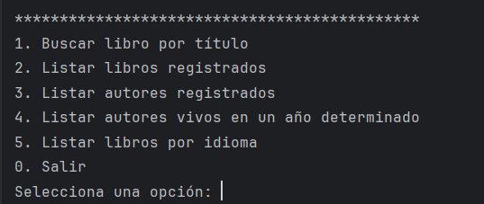
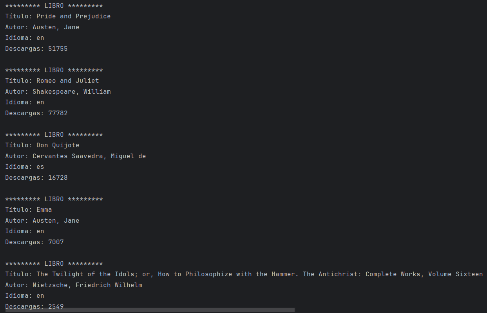
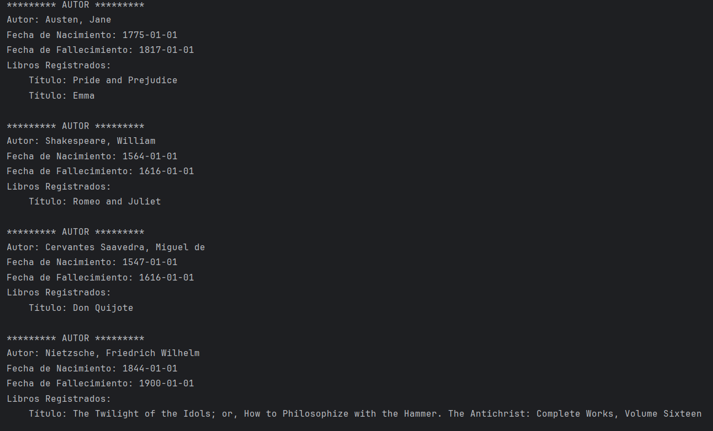
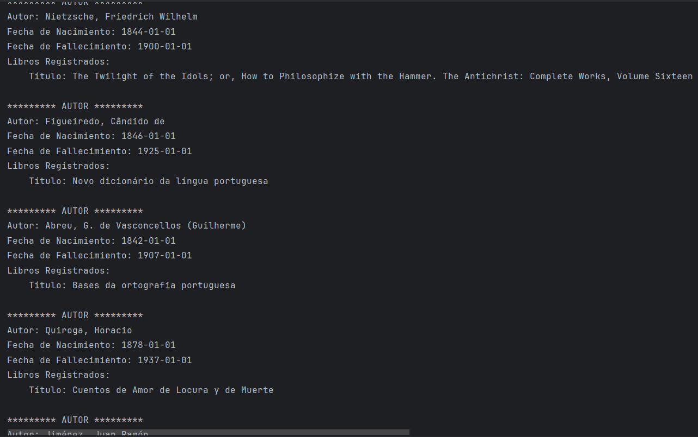
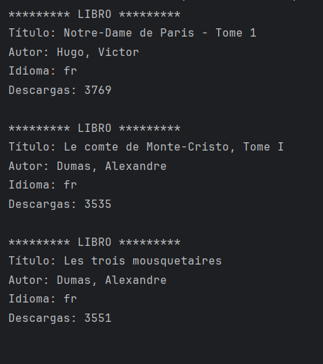

# LiterAlura


LiterAlura es una aplicación de consola que permite a los usuarios registrar libros en una base de datos y recibir información sobre estos libros utilizando la API de Gutendex. La aplicación está construida con Java 21, Maven, Spring Boot 3.3.1, Spring Data JPA y PostgreSQL.


## Funcionalidades

La aplicación LiterAlura incluye las siguientes funcionalidades:

1. **Buscar libro por título**: Permite al usuario buscar un libro por su título en la API de Gutendex y registrar la información del libro en la base de datos.
2. **Listar libros registrados**: Muestra una lista de todos los libros registrados en la base de datos.
3. **Listar autores registrados**: Muestra una lista de todos los autores registrados en la base de datos, incluyendo su nombre, fecha de nacimiento, fecha de fallecimiento y los libros registrados de cada autor.
4. **Listar autores vivos en un determinado año**: Muestra una lista de autores que estaban vivos en un año determinado, incluyendo su nombre, fecha de nacimiento, fecha de fallecimiento y los libros registrados de cada autor.
5. **Listar libros por idioma**: Muestra una lista de libros registrados en la base de datos filtrados por idioma, incluyendo título, autor, idioma y número de descargas.


## Ejecución

Para ejecutar la aplicación, sigue estos pasos:

1. Clona el repositorio a tu máquina local.
2. Configura la base de datos PostgreSQL y actualiza el archivo `application.properties` con tus credenciales.
3. Ejecuta la aplicación desde tu IDE o utilizando Maven.


## Configuración de la Base de Datos

Asegúrate de que tu archivo `application.properties` tenga la configuración correcta para conectarse a tu base de datos PostgreSQL:

```properties
spring.datasource.url=jdbc:postgresql://localhost:5432/literalura
spring.datasource.username=tu_usuario_de_db
spring.datasource.password=tu_contraseña_de_db
spring.jpa.hibernate.ddl-auto=update
spring.jpa.properties.hibernate.dialect=org.hibernate.dialect.PostgreSQLDialect
spring.jpa.show-sql=true
spring.jpa.properties.hibernate.format_sql=true
```


## Uso de la Aplicación

Al ejecutar la aplicación, se te presentará un menú con las opciones disponibles:

1. Buscar libro por título
2. Listar libros registrados
3. Listar autores registrados
4. Listar autores vivos en un año determinado
5. Listar libros por idioma
0. Salir
Selecciona una opción:


Buscar libro por título:
Selecciona la opción 1 e ingresa el título del libro que deseas buscar. La aplicación buscará el libro en la API de Gutendex y registrará la información en la base de datos si el libro no está ya registrado.

Listar libros registrados:
Selecciona la opción 2 para ver una lista de todos los libros registrados en la base de datos, incluyendo título, autor, idioma y número de descargas.

Listar autores registrados:
Selecciona la opción 3 para ver una lista de todos los autores registrados en la base de datos, incluyendo nombre, fecha de nacimiento, fecha de fallecimiento y los libros registrados de cada autor.

Listar autores vivos en un año determinado:
Selecciona la opción 4 e ingresa el año para ver una lista de autores que estaban vivos en ese año, incluyendo nombre, fecha de nacimiento, fecha de fallecimiento y los libros registrados de cada autor.

Listar libros por idioma:
Selecciona la opción 5 e ingresa el idioma (ES, EN, FR, PT) para ver una lista de libros registrados en ese idioma, incluyendo título, autor, idioma y número de descargas.


## Capturas de Pantalla

A continuación se muestran algunas capturas de pantalla de la aplicación en funcionamiento:

### Menú Principal


### Listado de Libros Registrados


### Listado de Autores Registrados


### Listado de Autores Registrados Vivos en un Determinado Año


### Listado de Libros Registrados por Idioma



## Tecnologías Utilizadas

- Java 21
- Spring Boot 3.3.1
- Spring Data JPA
- PostgreSQL
- Maven
